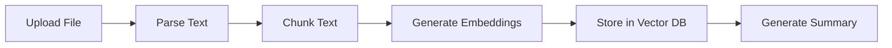
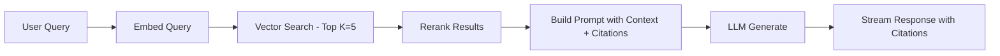

# NotebookLM Clone — Full Specification & Implementation Plan

## 1. Tổng Quan Dự Án

Clone toàn bộ giao diện và chức năng của Google NotebookLM, chạy self-hosted với khả năng sử dụng **API Key** (Google Gemini, OpenAI, Anthropic) hoặc **Local Model** (Ollama).

### Mục tiêu
- UI/UX giống NotebookLM (3-panel layout)
- RAG pipeline hoàn chỉnh (upload → chunk → embed → retrieve → generate)
- Hỗ trợ đa model (API + Local)
- Audio Overview (podcast-style)
- Study Tools (flashcards, quiz, mind map, study guide)

---

## 2. Mô Tả Giao Diện (UI Specification)

### 2.1 Trang Chủ — Dashboard

| Element | Mô tả |
|---------|--------|
| **Header** | Logo, user avatar, settings gear icon |
| **Create Button** | Nút "+ New Notebook" nổi bật |
| **View Toggle** | Tile View (card grid) / List View |
| **Sort** | By title, most recent |
| **Notebook Card** | Thumbnail, title, last modified, 3-dot menu (Rename, Delete) |

### 2.2 Notebook Workspace — 3-Panel Layout

```
┌──────────────┬─────────────────────────┬──────────────────┐
│              │                         │                  │
│   SOURCES    │         CHAT            │     STUDIO       │
│   (Left)     │        (Center)         │     (Right)      │
│              │                         │                  │
│  - File list │  - Message history      │  - Notes list    │
│  - Add btn   │  - Suggested questions  │  - Add note btn  │
│  - Toggle    │  - Input box            │  - Generate tools│
│  - Search    │  - Configure chat       │  - Audio Overview│
│              │  - Inline citations     │  - Study Guide   │
│              │                         │  - FAQ           │
│              │                         │  - Flashcards    │
│              │                         │  - Quiz          │
│              │                         │  - Mind Map      │
│              │                         │  - Timeline      │
└──────────────┴─────────────────────────┴──────────────────┘
```

#### Panel 1: Sources (Left — ~250px)
- **Add Source Button**: Upload files, paste URL, paste text
- **Source List**: Icon + filename + toggle checkbox (on/off)
- **Source Detail View**: Click → full text viewer + AI summary ở top
- **Supported Types**: PDF, DOCX, TXT, MD, CSV, URL, YouTube URL
- **Source Summary**: Auto-generated khi upload xong
- **3-dot Menu**: View, Remove, Re-sync

#### Panel 2: Chat (Center — flex grow)
- **Message History**: Scrollable, markdown rendered
- **Inline Citations**: `[1]`, `[2]` clickable → jump to source passage
- **Suggested Questions**: Auto-generated chips phía trên input
- **Chat Input**: Textarea + Send button + attachment
- **Configure Chat**: Modal/dropdown với:
  - Style: Default / Learning Guide / Custom (textarea)
  - Response Length: Shorter / Default / Longer
- **Save to Note**: Button trên mỗi AI response → save to Studio panel
- **Streaming**: Real-time token streaming

#### Panel 3: Studio (Right — ~300px)
- **Notes Section**:
  - Written notes (user-created, editable)
  - Saved responses (read-only, from chat)
  - Convert notes to source
- **Generate Tools** (1-click buttons):
  - 🎧 Audio Overview
  - 📋 Study Guide
  - ❓ FAQ Document
  - 🃏 Flashcards
  - 📝 Quiz
  - 🗺️ Mind Map
  - 📊 Timeline
  - 📄 Briefing Document

### 2.3 Source Detail View (Overlay/Side Panel)
- Full text content rendered
- AI-generated summary ở top
- Highlighted passages khi click citation
- Search within source

### 2.4 Settings Page
- **Model Provider**: Dropdown (Ollama / OpenAI / Google Gemini / Anthropic)
- **API Key Input**: Secure input field
- **Ollama URL**: Default `http://localhost:11434`
- **Model Selection**: Dropdown (auto-populated từ provider)
- **Embedding Model**: Selection
- **TTS Provider**: Selection (browser TTS / Kokoro / Piper)

---

## 3. Chức Năng Chi Tiết (Feature Specification)

### 3.1 Document Ingestion Pipeline



| Step | Detail |
|------|--------|
| **Parse** | PDF.js (PDF), Mammoth (DOCX), raw (TXT/MD/CSV), fetch+extract (URL) |
| **Chunk** | Recursive text splitter, 500-1000 tokens, 100 token overlap |
| **Embed** | Via selected model (OpenAI `text-embedding-3-small`, Ollama `nomic-embed-text`) |
| **Store** | ChromaDB (self-hosted vector DB) |
| **Summarize** | LLM call: "Summarize this document in 3-5 sentences" |

### 3.2 RAG Chat (Retrieval-Augmented Generation)



- **Retrieval**: Semantic search via ChromaDB, top-k=5
- **Context Window**: Include source metadata (filename, page) for citations
- **Citation Format**: `[1]` markers in response → map to source chunks
- **Streaming**: SSE (Server-Sent Events) for real-time token display
- **Suggested Questions**: LLM generates 3 questions from sources on load

### 3.3 Audio Overview (Podcast Generation)

| Step | Detail |
|------|--------|
| 1. Outline | LLM creates outline from sources |
| 2. Script | LLM generates 2-host conversation script |
| 3. Naturalize | Add disfluencies ("um", "ah", pauses) |
| 4. TTS | Convert to audio via TTS engine |
| 5. Play | In-browser audio player with download option |

- **Format Options**: Deep Dive, Brief, Debate, Custom instructions
- **TTS Options**: Browser Web Speech API (free) / Kokoro TTS / Piper (self-hosted)

### 3.4 Study Tools Generation

| Tool | Output |
|------|--------|
| **Study Guide** | Structured markdown: key concepts, definitions, relationships |
| **FAQ** | 10-15 Q&A pairs extracted from sources |
| **Flashcards** | Interactive flip cards (term ↔ definition), spaced repetition |
| **Quiz** | Multiple choice + short answer, with explanations + citations |
| **Mind Map** | Interactive node graph (D3.js/vis.js), expandable nodes |
| **Timeline** | Chronological events extracted from sources |
| **Briefing Doc** | Executive summary format |

### 3.5 Notes Management
- Create/edit/delete written notes
- Save chat responses as read-only notes
- Pin important notes
- Convert notes → new source (re-ingest into vector DB)
- Export notes to markdown file

### 3.6 Multi-Model Support

| Provider | Chat Model | Embedding Model | Config |
|----------|-----------|-----------------|--------|
| **Ollama** | llama3, qwen3, mistral, etc. | nomic-embed-text, mxbai-embed-large | URL: localhost:11434 |
| **OpenAI** | gpt-4o, gpt-4o-mini | text-embedding-3-small | API Key |
| **Google Gemini** | gemini-2.0-flash, gemini-2.5-pro | text-embedding-004 | API Key |
| **Anthropic** | claude-sonnet-4, claude-haiku | (use OpenAI embeddings) | API Key |

- Ollama endpoint: OpenAI-compatible `/v1/chat/completions`
- Tất cả providers share cùng interface, chỉ swap base URL + API key

---

## 4. Technology Stack

### Frontend
| Tech | Purpose |
|------|---------|
| **Next.js 15** (App Router) | Full-stack React framework |
| **Vanilla CSS** + CSS Variables | Styling with dark/light theme |
| **Markdown-it** | Render markdown in chat |
| **D3.js** | Mind map visualization |
| **PDF.js** | PDF rendering in source viewer |
| **Framer Motion** | Animations & transitions |

### Backend (Next.js API Routes)
| Tech | Purpose |
|------|---------|
| **ChromaDB** | Vector database (Docker) |
| **LangChain.js** | RAG orchestration |
| **PDF-parse** | Server-side PDF text extraction |
| **Mammoth** | DOCX parsing |
| **Cheerio** | URL content extraction |
| **youtube-transcript** | YouTube transcript fetch |

### Infrastructure
| Tech | Purpose |
|------|---------|
| **SQLite** (via better-sqlite3) | Metadata storage (notebooks, sources, notes, chat history) |
| **Docker Compose** | ChromaDB + optional Ollama |
| **Web Speech API / Kokoro** | Text-to-Speech for Audio Overview |

---

## 5. Data Models

### Notebook
```
id, title, created_at, updated_at, model_provider, model_name, 
embedding_model, custom_instructions
```

### Source
```
id, notebook_id, filename, file_type, original_url, 
raw_text, summary, word_count, enabled, created_at
```

### Chunk
```
id, source_id, notebook_id, content, chunk_index, 
page_number, embedding_id (ChromaDB ref)
```

### ChatMessage
```
id, notebook_id, role (user/assistant), content, 
citations (JSON array of {source_id, chunk_id, text}), created_at
```

### Note
```
id, notebook_id, title, content, type (written/saved), 
pinned, source_chat_message_id, created_at, updated_at
```

### Settings
```
id, provider, api_key (encrypted), ollama_url, 
chat_model, embedding_model, tts_provider, theme
```

---

## 6. Cấu Trúc Thư Mục

```
c:\Users\admin\Desktop\LLM\
├── app/
│   ├── layout.js                  # Root layout + theme
│   ├── page.js                    # Dashboard (notebook list)
│   ├── notebook/[id]/
│   │   └── page.js                # 3-panel workspace
│   ├── settings/
│   │   └── page.js                # Settings page
│   └── api/
│       ├── notebooks/             # CRUD notebooks
│       ├── sources/               # Upload, parse, ingest
│       ├── chat/                  # RAG chat + streaming
│       ├── notes/                 # CRUD notes
│       ├── generate/              # Study tools generation
│       ├── audio/                 # Audio overview generation
│       └── models/                # List available models
├── components/
│   ├── layout/
│   │   ├── Header.js
│   │   └── ThreePanel.js
│   ├── dashboard/
│   │   ├── NotebookCard.js
│   │   └── NotebookGrid.js
│   ├── sources/
│   │   ├── SourcePanel.js
│   │   ├── SourceItem.js
│   │   ├── SourceUpload.js
│   │   └── SourceViewer.js
│   ├── chat/
│   │   ├── ChatPanel.js
│   │   ├── ChatMessage.js
│   │   ├── ChatInput.js
│   │   ├── CitationBadge.js
│   │   └── SuggestedQuestions.js
│   ├── studio/
│   │   ├── StudioPanel.js
│   │   ├── NoteCard.js
│   │   ├── NoteEditor.js
│   │   ├── AudioOverview.js
│   │   ├── Flashcards.js
│   │   ├── QuizView.js
│   │   └── MindMap.js
│   └── ui/
│       ├── Button.js
│       ├── Modal.js
│       ├── Dropdown.js
│       └── Toggle.js
├── lib/
│   ├── db.js                      # SQLite connection
│   ├── vectordb.js                # ChromaDB client
│   ├── llm.js                     # Multi-provider LLM client
│   ├── embeddings.js              # Embedding generation
│   ├── rag.js                     # RAG pipeline
│   ├── parsers/
│   │   ├── pdf.js
│   │   ├── docx.js
│   │   ├── url.js
│   │   └── youtube.js
│   └── chunker.js                 # Text chunking logic
├── public/
│   └── fonts/
├── styles/
│   └── globals.css                # Design system + themes
├── docker-compose.yml             # ChromaDB + Ollama
├── package.json
└── next.config.js
```

---

## 7. Phân Pha Triển Khai (6 Phases)

### Phase 1: Foundation & Dashboard
- Next.js project setup + design system (dark theme, glassmorphism)
- SQLite database + schema
- Dashboard page: notebook CRUD, grid/list view
- Settings page: model provider configuration

### Phase 2: Source Management
- File upload UI (drag & drop)
- Parsers: PDF, DOCX, TXT, MD, CSV, URL, YouTube
- Text chunking + embedding generation
- ChromaDB integration (Docker)
- Source panel: list, toggle, delete, summary display

### Phase 3: RAG Chat
- Multi-provider LLM client (Ollama, OpenAI, Gemini, Anthropic)
- RAG pipeline: query → embed → retrieve → prompt → stream
- Chat UI: message history, streaming, markdown render
- Inline citations with click-to-source navigation
- Suggested questions generation
- Chat configuration (style, length)

### Phase 4: Notes & Studio
- Notes CRUD: create, edit, pin, delete
- Save chat response → note
- Convert notes → source
- Source detail viewer with highlight on citation click

### Phase 5: Study Tools
- Study Guide generator
- FAQ generator
- Flashcards (interactive flip UI)
- Quiz (interactive with scoring)
- Mind Map (D3.js interactive graph)
- Timeline generator
- Briefing document

### Phase 6: Audio Overview
- Script generation pipeline (outline → script → naturalize)
- TTS integration (Web Speech API as default)
- Audio player UI with download
- Format options (Deep Dive, Brief, Debate)

---

## 8. Open Questions

> [!IMPORTANT]
> **Lựa chọn Model mặc định**: Bạn muốn ưu tiên Ollama (local) hay API key (cloud) làm default? Điều này ảnh hưởng đến onboarding flow.

> [!IMPORTANT]
> **Audio Overview priority**: Tính năng Audio Overview (podcast) cần TTS engine riêng. Bạn muốn dùng Browser Web Speech API (miễn phí, chất lượng trung bình) hay setup Kokoro/Piper (chất lượng cao, cần cài thêm)?

> [!WARNING]
> **Embedding consistency**: Khi switch model provider, embeddings cũ sẽ không compatible với model mới. Cần re-embed toàn bộ sources. Bạn OK với behavior này?

> [!NOTE]
> **Docker requirement**: ChromaDB chạy via Docker. Bạn đã có Docker Desktop trên máy chưa?

---

## 9. Verification Plan

### Automated Tests
- `npm run build` — verify build thành công
- API route tests cho CRUD operations
- RAG pipeline test: upload sample PDF → ask question → verify cited response

### Manual Verification (Browser)
- Dashboard: create/rename/delete notebook
- Upload PDF + URL → verify chunking + summary
- Chat: ask question → verify streaming + citations
- Click citation → verify source viewer highlights correct passage
- Generate flashcards/quiz → verify interactive UI
- Audio Overview → verify playback
- Switch between Ollama ↔ OpenAI → verify both work
- Dark/Light theme toggle
